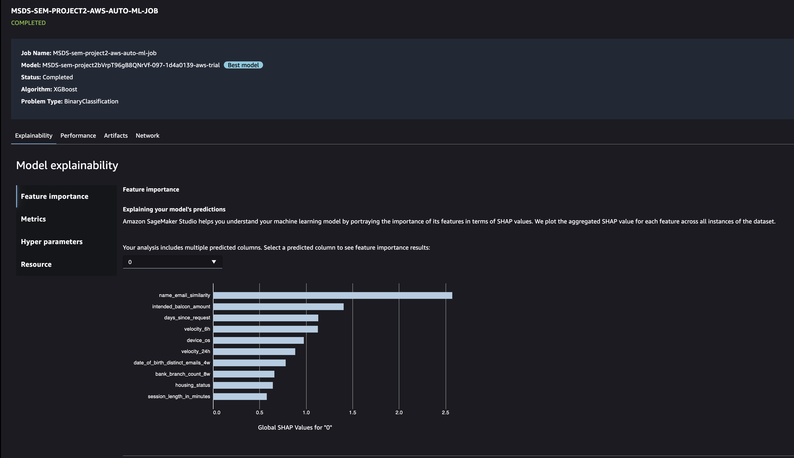
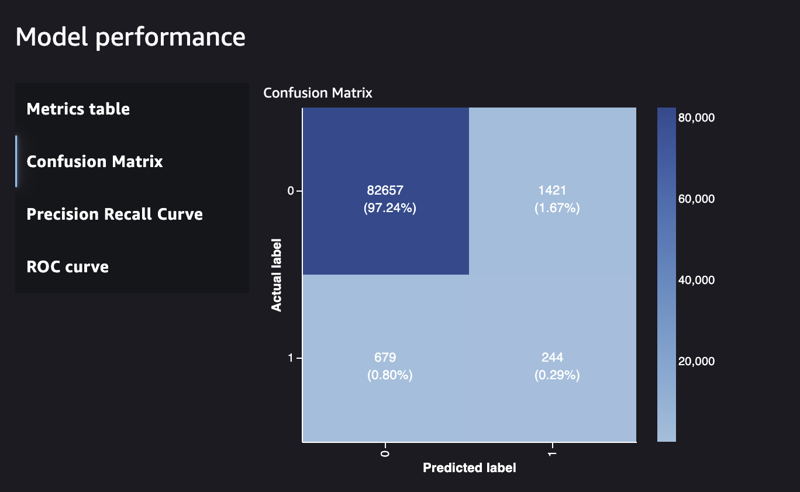
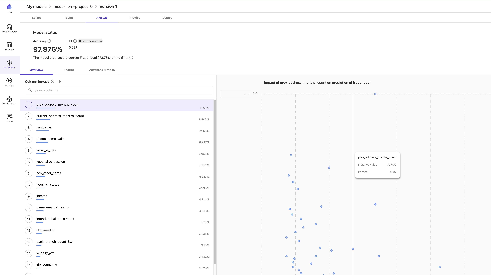

# MSDS Big Data Systems Semester Project 

## Part II: Exploration of Sagemaker AWS AutoML Capabilities Applied to Bank Account Fraud Detection  

### Introduction: 

AWS offers many advanced capabilities that can accelerate model development time compared to traditional model building processes. These capabilities include: 

- Fully managed services such as AWS Fraud Detector  

- AWS Sagemaker “jumpstart” service, which offers pre-built models for several use cases including Fraud Detection 

- Sagemaker AutoML that provides an automated model building process, while simplifying the model training and tuning process 

Automated machine learning and model building services accelerate model building time by removing the undifferentiated heavy lifting of creating infrastructure and by automating data preprocessing, feature selection and model tuning processes. This enables us to spend more time on domain specific problems. 

Our learning objective was to understand the advantages and disadvantages of using AWS AutoML compared with the traditional custom model development process in the context of the bank fraud detection use case. 
For our project we explored the AWS Sagemaker AutoML service to understand how it could be applied to develop a fraud detection model from our data set. We evaluated the results obtained through AutoML and compared them to the results obtained through traditional customized model development processes. Our end goal is to determine to what extent the use of  AutoML provided advantages in terms of model building speed, performance  and cost compared to a traditional approach. We hope to share these insights for future teams when deciding what approach to be taken for model building for a given budget. 

### Data: 

The same data set was used for the AWS AutoMl as was used for the traditional model building process. The data set is the Bank Account Fraud Dataset Suite, comprising six synthetic bank account tabular datasets. The Base dataset was used for the experiment. The original dataset consisted of 1 million instances and 30 features used in fraud detection use-case.  The data set is in a comma delimited format. The data set did not require any preprocessing as the analysis showed the data set had no missing or mismatched values, as expected from a Kaggle data set.

The following shows the results from a data analysis results obtained from Sagemaker AutoML.

### Experiment Design: 

The data set for the experiment was the Bank Account Fraud Dataset Suite - https://www.kaggle.com/datasets/mlg-ulb/creditcardfraud. 

To reduce training costs, the original data set was subsetted using the SciKit learn library’s train_test_split function to reduce the data set to a smaller subset of records. We used a Python script to create two smaller subsets from the Base.csv dataset. 

Train.csv - 425,000 Rows. - To be used as the training dataset. 

Test.csv - 75,000 Rows –To be used as the test data set. 

These two files were loaded into AWS S3 at the following location. 

https://us-east-1.console.aws.amazon.com/s3/object/msds-sem-project1022?region=us-east-1&bucketType=general&prefix=test.csv 

https://us-east-1.console.aws.amazon.com/s3/object/msds-sem-project1022?region=us-east-1&bucketType=general&prefix=train.csv 

Through the AWS console within the Sagemaker service, AutoML was used to automate the model building process.  AutoML simplified the process of splitting the data set, so all the was required was pointing the AutoML process to a data set.  The Train.CSV was used for the AutoML process.  Auto ML handled the preprocessing and split the data set into test and training sets internally.   

We ran two separate AutoML processes. The first was using Canvas within Sagemaker. This is a new interface for accessing AutoML, which provides simplified result and visualizations.  The second was using the Sagemaker Studio Classic, which was described in Chapter 3 of the textbook.  

### Beyond the Original Specification 

AWS services used for analysis and exploration beyond the original specification included the following: 

- AWS Athena - We used AWS Athena to perform some initial interactive queries on the source data file Base.csv.  We loaded the Base.csv file into an S3 bucket.  We then issued a few AWS CLI commands to partition the data into the Parquet format along the dimesion of the employment_status field.  This was intended to understand how the AWS Athena service worked and its ability to enable us to query data directly from S3 and not requiring us to load data into a Red Shift data warehouse. 

- AWS Lake Formation: In addition, we experimented with the AWS Lakehouse Formation.  We created an AWS Lakehouse and created a database for the semester project that housed a fraud_tbl and fraud_tbl_parquet, providing centralized access to our data sources. 

- AWS Glue – We indirectly used the AWS Glue service when using the Athena service as we had to define the schema on demand for the fraud_tbl  before we were able to query the data. 

### Results 

We will first review the results from the AutoML process run under the Studio Classic, and then share the results produced under the Sagemaker Canvas service. 

### Sagemaker Studio Classic 

Auto-pilot ML ran 100+ training jobs to optimize the selected model. The best model selected by AutoMl include an F1 score of 0.189 and an Accuracy of 0.975.

#### Best Model

#### Model Performance

#### Feature Importance

#### Confustion Matrix

### Sagemaker Canvas

The results using the Canvas interface.

#### Data Analysis

#### Model Leaderboard

#### Best Model

### Testing

### Conclusions