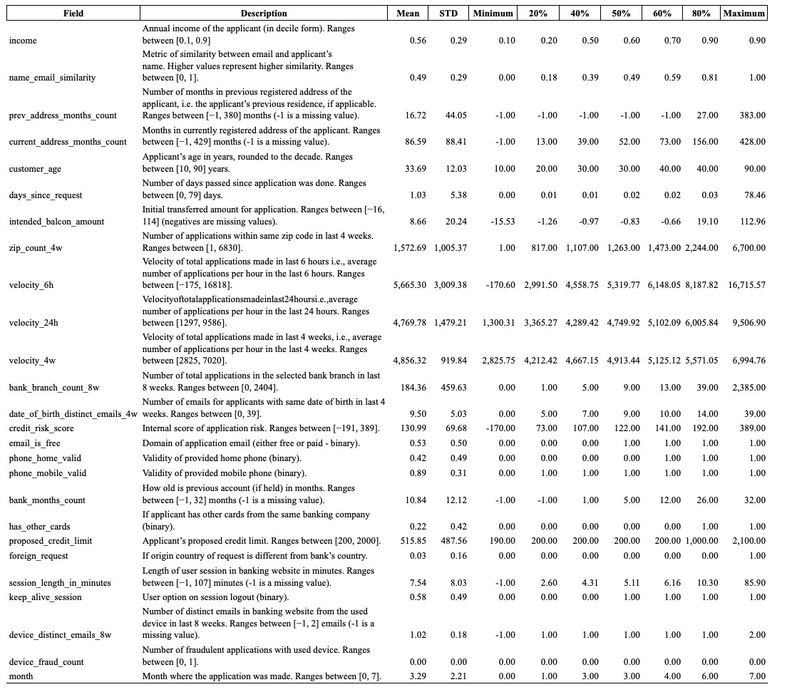
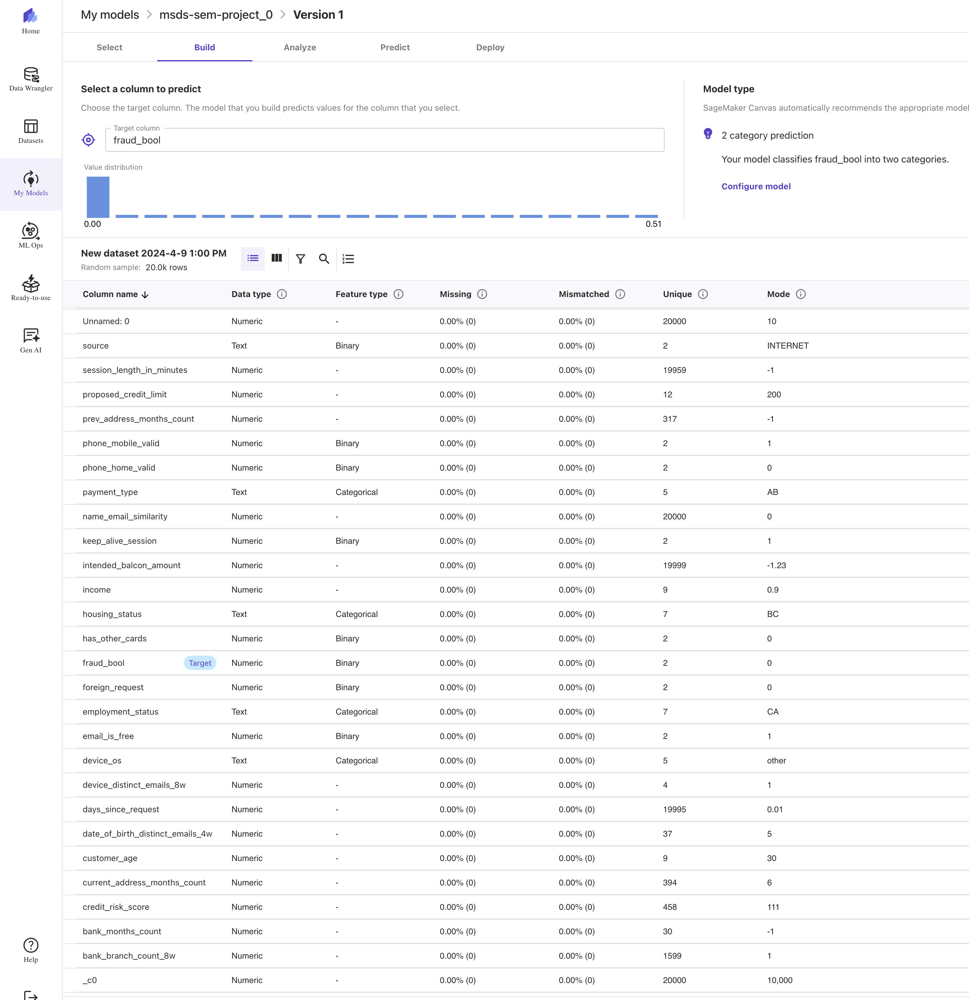
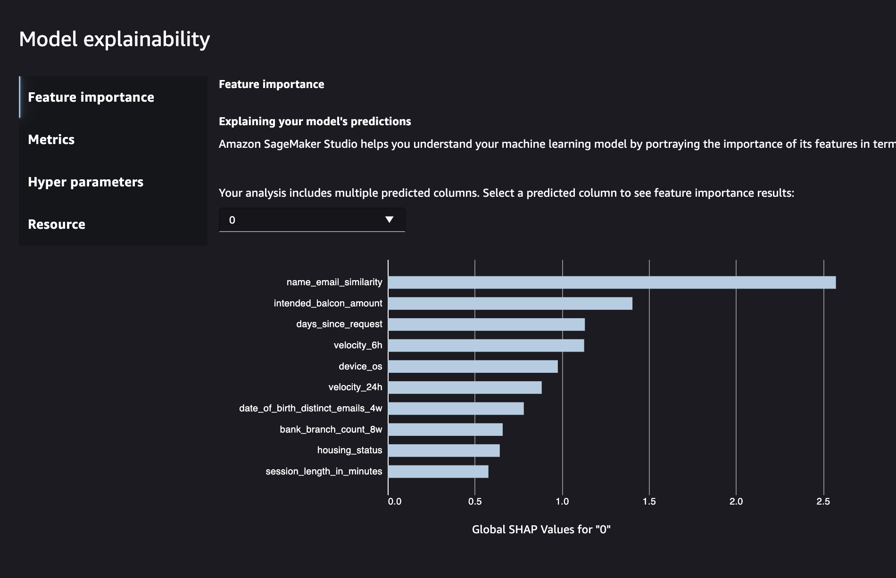
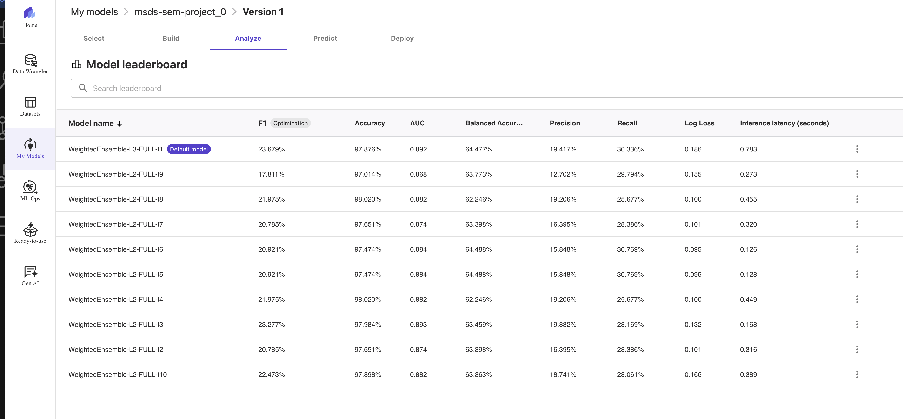

# MSDS Big Data Systems Semester Project 

###  Exploration of Sagemaker AWS AutoML Capabilities Applied to Bank Account Fraud Detection  

# Introduction: 

AWS offers many advanced capabilities that can accelerate model development time compared to traditional model building processes. These capabilities include: 

- Fully managed services such as AWS Fraud Detector  

- AWS Sagemaker “jumpstart” service, which offers pre-built models for several use cases including Fraud Detection 

- Sagemaker AutoML that provides an automated model building process, while simplifying the model training and tuning process 

Automated machine learning and model building services accelerate model building time by removing the undifferentiated heavy lifting of creating infrastructure and by automating data preprocessing, feature selection and model tuning processes. This enables us to spend more time on domain specific problems. 

Our learning objective was to understand the advantages and disadvantages of using AWS AutoML compared with the traditional custom model development process in the context of the bank fraud detection use case. 
For our project we explored the AWS Sagemaker AutoML service to understand how it could be applied to develop a fraud detection model from our data set. We evaluated the results obtained through AutoML and compared them to the results obtained through traditional customized model development processes. Our end goal is to determine to what extent the use of  AutoML provided advantages in terms of model building speed, performance  and cost compared to a traditional approach. We hope to share these insights for future teams when deciding what approach to be taken for model building for a given budget. 

# Data: 
When conducting our research to identify a dataset related to fraud, we came across datasets where the predictor variables were transformed or had the predictor variables with coded field names and/or values due to confidentiality issues. For this project we wanted a dataset that would have identifiable variables that would resemble the types of fields and values you would actually see in a bank account opening application. Consequently, for this project we choose to use the Bank Account Fraud Dataset Suite (https://www.kaggle.com/datasets/sgpjesus/bank-account-fraud-dataset-neurips-2022/data) obtained from Kaggle to create a model that will identify fraudulent bank account opening applications. 
 
The Bank Account Fraud Dataset Suite consists of 6 separate datasets with each stored in a separate CSV file: base, variant 1, variant 2, variant 3, variant 4, and variant 5. All of the data was synthetically generated by a generative model (CTGAN) that was trained on real-world anonymized bank account opening fraud data (https://github.com/feedzai/bank-account-fraud/blob/main/documents/datasheet.pdf). For this project we are utilizing the base dataset, which was sampled to best represent the original dataset. 

The base data consists of one million observations. Each observation in the dataset represents a bank account opening application. The data has 30 predictor variables of which 5 are categorical variables, while the rest are numeric. The data provides various features related to the applicant like their income, employment status, a field indicating the similarity between the email provided and the applicant’s name, credit risk score, housing status, fields indicating the validity of telephone numbers provided, month of when the application was made, the number of minutes the applicant spent on the banking website, and various other fields. 

The table below shows summary statistics for the predictor variables in the data. 

We conducted exploratory data analysis to get familiar with the data, understand the fields and values provided, and evaluate whether there was any preprocessing, data cleaning, or outlier removal needed before we started the modeling process. We applied basic cleaning to the string/character variables so they would all be uppercase and have no leading or trailing blanks. The values for the string/character variables were otherwise harmonized, so no additional cleaning was needed. For 5 of the variables in the data (prev_address_months_count, current_address_months_count, bank_months_count, session_length_in_minutes, and device_distinct_emails) the missing values were coded as -1. The intended_balcon_amount variable had its missing values coded as negative values. Using imputation for the missing data did not seem appropriate due to the nature of the data. 

Based on looking at the correlations between the variables in the data we decided to:  

1. drop date_of_birth_distinct_emails_4w while keeping customer_age (due to correlation between the variables)
2. drop month, velocity_6h, and velocity_4w while keeping velocity_24h (due to correlation between the variables)
3. proposed_credit_limit and credit_risk_score both have high correlations to each other, therefore only one can be used in a given model

There weren’t any extreme outliers we needed to remove from our data. Also there were no duplicate observations in the data as expected. As part of the data pre-processing, we created fields that were standardized for use in some of our model training experiments. 

Our models utilize the “fraud_bool” field as our response variable. It is an indicator variable, which is equal to 1 if the bank account opening application is fraudulent and equal to 0 if it is not fraudulent, thus a legitimate bank account application. The data is imbalanced: only 1.1% of transactions have fraud_bool equal to 1.

The following shows the results from a data analysis results obtained from Sagemaker AutoML.

# Experiment Design: 

To reduce training costs, the original data set was subsetted using the SciKit learn library’s train_test_split function to reduce the data set to a smaller subset of records. We used a Python script to create two smaller subsets from the Base.csv dataset. 

The python script used to sample the original data set can be found at 

- Train.csv - 425,000 Rows. - To be used as the training dataset. 

- Test.csv - 75,000 Rows –To be used as the test data set. 

These two files were loaded into AWS S3 at the following location. 

- https://us-east-1.console.aws.amazon.com/s3/object/msds-sem-project1022?region=us-east-1&bucketType=general&prefix=test.csv 

- https://us-east-1.console.aws.amazon.com/s3/object/msds-sem-project1022?region=us-east-1&bucketType=general&prefix=train.csv 

Through the AWS console within the Sagemaker service, AutoML was used to automate the model building process.  AutoML simplified the process of splitting the data set, so all the was required was pointing the AutoML process to a data set.  The Train.CSV was used for the AutoML process.  Auto ML handled the preprocessing and split the data set into test and training sets internally.   

# Beyond the Original Specification 

AWS services used for analysis and exploration beyond the original specification included the following: 

- AWS Athena - We used AWS Athena to perform some initial interactive queries on the source data file Base.csv.  We loaded the Base.csv file into an S3 bucket.  We then issued a few AWS CLI commands to partition the data into the Parquet format along the dimesion of the employment_status field.  This was intended to understand how the AWS Athena service worked and its ability to enable us to query data directly from S3 and not requiring us to load data into a Red Shift data warehouse. 

- AWS Lake Formation: In addition, we experimented with the AWS Lakehouse Formation.  We created an AWS Lakehouse and created a database for the semester project that housed a fraud_tbl and fraud_tbl_parquet, providing centralized access to our data sources. 

- AWS Glue – We indirectly used the AWS Glue service when using the Athena service as we had to define the schema on demand for the fraud_tbl  before we were able to query the data. 

# Results 

We will first review the results from the AutoML process run under the Studio Classic, and then share the results produced under the Sagemaker Canvas service. 

## Sagemaker Studio Classic 

Auto-pilot ML ran 100+ training jobs to optimize the selected model. The best model selected by AutoMl include an F1 score of 0.189 and an Accuracy of 0.975.
 
## Model Building Results
The following shows the results from 100 differnt model builds performed by Sagemaker AutoML

## Model Performance

## Feature Importance and Model Explainability

## Confusion Matrix

# Sagemaker Canvas

Sagemaker Canvas is a new user interface and experience for automated model building. The results using the Canvas interface are visually more appealing and more user friendly. This is aimed at making model building very fast for users with less experience, but who need to have a model built quickly. 

## Model Leaderboard
The model leaderboard shows the top performing models 

## Model Results
The following displays the overall model accuract, F1 score and impact each data element contributed to the score.

## Confusion Matrix
The following shows the detailed metrics within the confusion matrix.

# Testing

We ran a manual batch test within Canvas using our test data set of 75,000 rows.  This was performed from within the Canvas interface. It demonstrated that the model was working and ready for deployment.  We did not deploy the model; however, this can be done from within the Canvas console.

# Conclusions

The results using the two different AutoML processes produced different model results. The Sagemaker studio classic provided all the model results and reports back to S3 bucket, providing full model building transparancy.

#### Advantages
- Simple, intuitive interface that requires no coding to get a model up a running quickly
- AWS selects the best algorithm based on the use case (e.g., 2 category prediction)
- Fully automates process of splitting data set, model building and tuning
- Runs many different combinations of hyper parameters and provides you top performing model
- Easy to run manual and batch predictions 
- Simple model deployment

#### Disadvantages
- Costly using AWS environment  to run everything inside AWS
- Less control over the algorithm choice and hyper parameter choices
